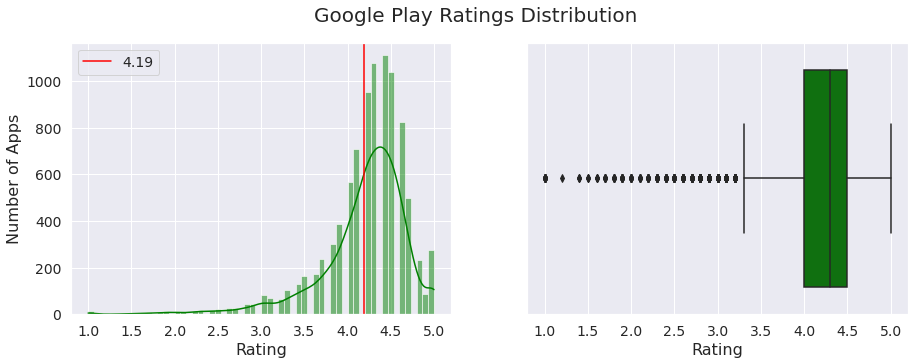

# Visualization

- 10841 Apps
- 33 Categories
- 2 Types (Free and Paid)

## 1. Most common app categories on Google Play Store (in number of apps)
<strong>Family</strong>, <strong>Game</strong> and <strong>Tools</strong> are the most common app categories (in number of apps).

The <strong>other 30 categories</strong> represent <strong>63.5%</strong> of the applications. But <strong>each category</strong> is responsible for <strong>less than 5%</strong> of the applications.

## 2. Most popular Google Play Categories (in number of downloads)
<strong>Game</strong> and <strong>Communication</strong> are the most popular app categories. <strong>Together</strong> they are responsible for about <strong>40% of all Google Play Store downloads</strong>.

## 3. Rating Distribution
### 3.1 Overall
The <strong>majority (86.4%)</strong> of the Google Play Apps <strong>receive a user rating</strong>.

<strong>Most</strong> Google Play Apps have <strong>good ratings (4.0 ~ 4.5)</strong>

The <strong>average app rating</strong> is <strong>4.19</strong>

### 3.2 Across the 3 most popular categories
The rating distribution is <strong>similar</strong> across the <strong>3 most popular app categories</strong>

### 3.3 Free Apps x Paid Apps
The rating distribution is <strong>similar</strong> between <strong>Paid and Free apps</strong>

## 4. Pricing Strategy
<strong>Most (92.6%)</strong> of the apps available on Google Play Store are <strong>Free</strong>

Paid apps <strong>prices</strong> usually range from <strong>1.5 to 4 dollars</strong>. And most of the top rated apps are also placed in this range.

## 5. App Size Distribution
App sizes usually range from <strong>2 to 26 megabytes</strong>.

## 6. Content rating distribution
The <strong>majority (80.4%)</strong> of the Google Play Apps are directed towards people of <strong>all ages</strong>.

## 7. Minimum Android Version Required
<strong>Most of the Google Play Apps (64.2%)</strong> require the user to have a device running <strong>at least Android 4.0</strong> (which was launched in 2011/12).

## 8. Most Common Words in Reviews

